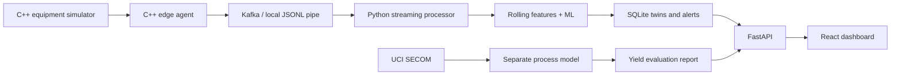

# FabTwin

### Edge-AI Digital Twin & Predictive Maintenance for Semiconductor Manufacturing

FabTwin monitors simulated manufacturing equipment, tracks each machine's condition, and raises maintenance alerts when sensor behaviour changes. It combines a **multithreaded C++ edge agent**, **Python ML pipelines**, **persistent digital twins**, and a **React dashboard**.

**Project status:** The local pipeline is built and tested. Kafka transport and Docker deployment are implemented but still need end-to-end validation. This is an engineering prototype, not a production-validated fab monitoring system.

## Two separate monitoring paths

| Equipment monitoring | Semiconductor process analysis |
|---|---|
| Telemetry from a controlled C++ simulator | Real manufacturing data from UCI SECOM |
| Temperature, pressure, vibration, power, flow rate and cycle time | Anonymized process measurements and pass/fail labels |
| Simulated degradation and failure prediction | Process-related yield-risk classification |

SECOM columns are never presented as named physical sensors. Equipment predictions describe simulated behaviour, not validated real-world failure risk.

## Features

- **Equipment simulation:** etchers, deposition tools, inspection tools and cleaners move through operation, degradation, faults and maintenance.
- **Multithreaded edge processing:** separate C++ threads collect readings, validate and preprocess them, and publish telemetry.
- **Outage recovery:** bounded queues retain readings while publishing retries. Full queues pause collection instead of silently dropping events.
- **Persistent digital twins:** SQLite stores current machine state, sensor history, health scores and predictions.
- **Predictive maintenance:** Random Forest predicts faults; Isolation Forest detects unusual sensor patterns.
- **Alert management:** repeated active alerts are suppressed; maintenance or recovery resolves them.
- **Live dashboard:** equipment health, sensor trends, failure risk and maintenance history.
- **Independent yield analysis:** SECOM evaluation and influential anonymous process signals.

## Architecture



Equipment follows this controlled lifecycle:

```text
IDLE → RUNNING → DEGRADING → FAULT → MAINTENANCE → RUNNING
```

During degradation, vibration and temperature gradually increase while other signals change. The local development path uses JSONL pipes and does not require Kafka.

## Technology stack

| Layer | Technology |
|---|---|
| Simulator and edge | C++17, threads, mutexes, condition variables, bounded queues |
| Transport | Kafka with librdkafka / confluent-kafka; local JSONL alternative |
| Processing and ML | Python, NumPy, pandas, scikit-learn |
| Storage | SQLite |
| API | FastAPI |
| Dashboard | React, Vite |
| Deployment | Docker Compose |

## Quick start — Windows

### 1. Prerequisites

Install Python 3.10+, Node.js 22+, Git, and a C++17 compiler with threading support, such as MSYS2 MinGW-w64. The build script automatically uses `C:\msys64\mingw64\bin` when available. Older MinGW distributions may lack `std::thread` support.

### 2. Clone and install

Run in PowerShell:

```powershell
git clone https://github.com/keerthanab2201/FabTwin.git
cd FabTwin
python -m venv .venv
.\.venv\Scripts\Activate.ps1
python -m pip install -e '.[test]'
.\scripts\build_edge.ps1

cd frontend
npm ci
npm run build
cd ..
```

### 3. Start the API and dashboard

In the first terminal, from the project root:

```powershell
.\.venv\Scripts\Activate.ps1
python -m uvicorn backend.main:app --host 127.0.0.1 --port 8000
```

### 4. Start the simulated equipment

Open another terminal in the project root:

```powershell
.\.venv\Scripts\Activate.ps1
python scripts/local_demo.py
```

Open the **[dashboard](http://127.0.0.1:8000)** or **[interactive API documentation](http://127.0.0.1:8000/docs)**.

The demo runs 24 simulated machines. Predictions display as unavailable until you train the equipment model. Telemetry, heuristic health scores and threshold alerts work without a model.

Use **Ctrl+C** to stop each process. For a finite simulation that drains its queues, run `python scripts/local_demo.py --ticks 60`.

<details>
<summary><strong>Linux / macOS setup</strong></summary>

Install Python, Node.js, CMake and a C++17 compiler. After cloning:

```sh
python3 -m venv .venv
source .venv/bin/activate
python -m pip install -e '.[test]'
cmake -S edge -B build -DCMAKE_BUILD_TYPE=Release
cmake --build build
cd frontend
npm ci
npm run build
cd ..
python -m uvicorn backend.main:app --host 127.0.0.1 --port 8000
```

In another terminal, activate the same environment and run:

```sh
python scripts/local_demo.py --edge build/fabtwin-edge
```

</details>

## Train the models

### Equipment failure and anomaly models

Generate readings directly from the compiled C++ simulator, then train:

```powershell
python -c "import subprocess; f=open('data/equipment.jsonl','w',encoding='utf-8'); subprocess.run(['build/fabtwin-edge.exe','--machines','24','--ticks','480','--interval-ms','0'],stdout=f,check=True); f.close()"
python -m ml.train_equipment data/equipment.jsonl
```

On Linux/macOS, replace `build/fabtwin-edge.exe` with `build/fabtwin-edge`.

The pipeline builds rolling mean, standard deviation, maximum and per-cycle slope features. It predicts an observed fault within the next **20 operating cycles**, holding out entire machines for evaluation. Logistic Regression and Random Forest are evaluated; Random Forest is the preselected serving model. Isolation Forest learns normal sensor windows.

Models are saved to `artifacts/equipment.joblib`; metrics go to `artifacts/equipment.json`. **Restart the local demo or Kafka consumer after training** to load the model. Probabilities have not been calibrated against real equipment failures.

### SECOM process model

```powershell
python scripts/download_secom.py
python -m ml.train_secom data/secom
```

This downloads the official **[UCI SECOM dataset](https://archive.ics.uci.edu/dataset/179/secom)** and trains a separate pass/fail classifier. The downloaded file contains **1,567 observations and 590 numeric process columns**, including missing values.

Preprocessing and feature selection are fitted on training data only. The final 20% of observations by timestamp is held out. Results appear under **Process & yield** in the dashboard and in `artifacts/secom-report.json`.

Attribution: McCann & Johnston, *SECOM*, UCI Machine Learning Repository, DOI `10.24432/C54305`.

## Tests and measured results

```powershell
python -m pytest -q
python scripts/benchmark.py build/fabtwin-edge.exe
```

Build the edge executable first; otherwise C++ tests are skipped. On Linux/macOS, use `build/fabtwin-edge` for the benchmark.

Initial verification: **9 tests passed** and the **React production build passed**. Tests cover queue backpressure, ordering, state transitions, duplicate delivery, stale events, alert deduplication, invalid telemetry, features, labels and API responses.

### Outage recovery

| Measurement | Observed result |
|---|---|
| Simulated publishing outage | 30 seconds |
| Simulated devices | 100 |
| Events generated / received | 30,000 / 30,000 |
| Events lost | 0 |
| Per-machine ordering | Preserved |

This test uses the **C++ edge agent and a local JSONL sink**. It does not establish Kafka recovery performance or full-system throughput. The report is generated at `artifacts/outage-report.json`.

### Model evaluation

| Metric | Equipment Random Forest | SECOM Logistic Regression |
|---|---:|---:|
| Precision | 0.9953 | 0.1067 |
| Recall | 0.7071 | 0.4706 |
| F1 | 0.8268 | 0.1739 |
| Average precision (PR summary) | 0.9553 | 0.1704 |
| False-alarm rate | 0.000384 | 0.2256 |
| Decision threshold | 0.8 | 0.5 |

These are different tasks and test sets, not a head-to-head model comparison. Equipment results apply only to controlled simulation. SECOM is an initial baseline with a high false-alarm rate; its holdout has only 17 failures among 314 examples.

## Docker and Kafka

With Docker Desktop running:

```powershell
docker compose up --build
```

Compose starts Kafka, topic initialization, the C++ edge, the Python consumer and the API/dashboard. Open [localhost:8000](http://127.0.0.1:8000).

**This path still needs end-to-end validation.** The initial environment had no running Docker daemon. The configuration uses one broker and is intended for development.

## API overview

| Endpoint | Returns |
|---|---|
| `GET /machines` | All current digital twins |
| `GET /machines/{id}` | Machine state and readings |
| `GET /machines/{id}/health` | Health, predictions and deviations |
| `GET /machines/{id}/telemetry` | Recent sensor history |
| `GET /machines/{id}/alerts` | Machine alert history |
| `GET /alerts` | Recent alerts across machines |
| `GET /metrics` | Event counts and ingestion latency |
| `GET /process/report` | SECOM evaluation results |
| `GET /healthz` | API liveness |

Example machine ID: `ETCHER_1`.

## Repository layout

```text
FabTwin/
├── edge/                 # C++ simulator, queues and publishing agent
├── streaming/            # Validation, rolling features and consumer
├── digital_twin/         # SQLite state, history and alerts
├── ml/                   # Equipment and SECOM training/evaluation
├── backend/              # FastAPI application
├── frontend/             # React dashboard
├── scripts/              # Build, demo, download and benchmark tools
├── tests/                # C++ edge and Python pipeline tests
├── docs/                 # Detailed engineering notes
├── data/                 # Local datasets and database; ignored by Git
├── artifacts/            # Local models and reports; ignored by Git
├── docker-compose.yml
└── README.md
```

## Limitations and next steps

- **Memory-only buffering:** transport outages are covered while the edge process stays alive; crashes or power loss can lose queued readings.
- **Simplified equipment behaviour:** machine types share controlled sensor equations rather than calibrated fab physics.
- **Unverified Kafka deployment:** broker integration and the Kafka-enabled C++ build still need testing.
- **Metrics still to measure:** full-system throughput, recovery-only duration and alert detection latency.
- **Local prototype:** authentication, history retention, durable spooling and graceful shutdown need further work before wider deployment.

For feature definitions, transaction guarantees, model interpretation and deployment details, see the **[engineering notes](docs/engineering.md)**.
